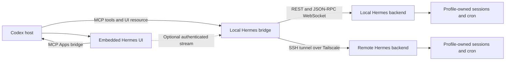

**Hermes in Codex: extension proposal**  
Research date: 30 September 2026. Status: researched and proposed; no extension has been implemented or installed.

Build a private MCP plugin that opens a Hermes application inside Codex. Use a custom React chat view styled with OpenAI’s UI components, and connect it through a small bridge to Hermes’s existing desktop backend. Start with chat, profile selection and cron inspection. Add cron management and wider ChatGPT distribution after the basic experience works.

The important distinction is that the panel owns the Hermes conversation. Codex’s surrounding conversation retains its own agent runtime. A plugin can expose Hermes tools to that conversation, but there is no documented plugin mechanism for replacing the native Codex conversation runtime with Hermes. Codex custom model providers are a separate mechanism, currently using the Responses protocol; making a Hermes shim for that route would introduce unnecessary coupling between two agent loops. [Custom providers](https://learn.chatgpt.com/docs/config-file/config-advanced#custom-model-providers), [configuration reference](https://learn.chatgpt.com/docs/config-file/config-reference).

The extension route is credible. OpenAI documents MCP Apps UI resources and OpenAI MCP Extensions for sidebar applications (`global`) and conversation panels (`thread`). A render tool identifies its resource with `_meta.ui.resourceUri`; extension entrypoints use `_meta["openai/ui"].entrypoints`. The portable UI bridge uses JSON-RPC over `postMessage`. [MCP Apps UI](https://developers.openai.com/plugins/build/chatgpt-ui), [Plugin Extensions](https://developers.openai.com/plugins/build/extensions).

Read-only inspection of the installed desktop app, version 26.928.21956, found implementations for global MCP app views, thread panels, local/hosted routing and translation of Codex styling into Apps SDK tokens. This is implementation evidence, not a live test of a new plugin: account access, discovery, feature gates, transport and rendering still need verification. Public UI documentation mainly describes ChatGPT, so Codex acceptance is the first implementation gate.

Hermes already has most of the required backend. Its desktop app uses `hermes serve`, JSON-RPC over `/api/ws`, and REST endpoints for management. This is a closer fit than wrapping an interactive CLI. The same backend supplies sessions, streamed messages, tool activity, questions, interruption and reconnect recovery. [Programmatic integration](https://github.com/NousResearch/hermes-agent/blob/653bc4f288fc00db362c1082a3b652542314fbef/website/docs/developer-guide/programmatic-integration.md).

The research separately checked your remote installation. The checkout was clean at `e5efafb475ed3dabe769ecfff335d2f974a1e8b9`; the gateway and dashboard system services were active. Six profile homes held 55 cron jobs, of which 53 were enabled, and each had execution and delivery ledgers. These are current source, process and stored-state observations. They do not prove model inference, loaded-code revision or successful delivery. Public upstream research was pinned to `653bc4f288fc00db362c1082a3b652542314fbef`; compatibility with your installed branch must be checked explicitly.

The proposed architecture is:

Use TypeScript for the MCP server/bridge and React frontend, with `@modelcontextprotocol/sdk`, `@modelcontextprotocol/ext-apps`, `@openai/mcp-extensions` and `@openai/apps-sdk-ui`. Keep the UI, MCP surface and Hermes protocol adapter separate so the same frontend can later use a hosted bridge. OpenAI’s component library supplies matching controls and design tokens. Hermes remains responsible for its agent loop, model selection, tools, memory and scheduler. [UI guidelines](https://developers.openai.com/plugins/concepts/ui-guidelines).

The integration should map the following existing interfaces:

| Feature | Existing Hermes interface | Extension behaviour |
|---|---|---|
| Start a conversation | `session.create` with explicit profile and remote-appropriate `cwd` | Keep both runtime and stored session identifiers. Inherit the profile’s model/provider settings. |
| Continue a conversation | `session.resume` / `session.activate` | Restore history and any unanswered question. |
| Send a message | `prompt.submit` | Treat acknowledgement and completion separately. Render `message.delta` and `message.complete`. |
| Show work | `tool.start`, `tool.generating`, `tool.complete` | Display expandable tool activity with bounded output. |
| Stop a turn | `session.interrupt` | Show cancelling until the authoritative final state arrives. |
| Questions and approvals | Peer JSON-RPC requests | Advertise `server_requests`, return responses with matching request IDs and remove cancelled question cards. |
| Recover a connection | `session.events.since` | Use sequence/epoch recovery; reload state when the replay window is truncated. |
| List profiles | `profiles.list` or `GET /api/profiles` | Scope the panel and its sessions without changing the machine’s sticky active profile. |
| List cron | `GET /api/cron/jobs?profile=<name>` or `profile=all` | Offer selected-profile and all-profile views. |
| Inspect past runs | `GET /api/cron/jobs/{id}/runs` scoped to owner profile | Show agent and script-only runs with their actual owner. |

These mappings are verified in the [session contracts](https://github.com/NousResearch/hermes-agent/blob/653bc4f288fc00db362c1082a3b652542314fbef/tui_gateway/contracts/sessions.py), [gateway guidance](https://github.com/NousResearch/hermes-agent/blob/653bc4f288fc00db362c1082a3b652542314fbef/tui_gateway/AGENTS.md) and [cron router](https://github.com/NousResearch/hermes-agent/blob/653bc4f288fc00db362c1082a3b652542314fbef/hermes_cli/web_routers/cron.py).

Use a small version-pinned Hermes adapter. `@hermes/shared` contains a useful browser-compatible `JsonRpcGatewayClient` and generated contracts, but it is an internal, private workspace package at version `0.0.0`, not a stable npm SDK. Either vendor the minimal client modules with their MIT licence attribution or implement the small protocol subset against pinned generated types/OpenRPC contracts. Test the adapter against the installed backend before upgrading it. [Shared package](https://github.com/NousResearch/hermes-agent/blob/653bc4f288fc00db362c1082a3b652542314fbef/apps/shared/package.json), [client source](https://github.com/NousResearch/hermes-agent/blob/653bc4f288fc00db362c1082a3b652542314fbef/apps/shared/src/json-rpc-gateway.ts).

For the first deployment, run the bridge on the Mac and let it connect to local Hermes or the remote dashboard/backend through an SSH tunnel over Tailscale. Use the existing SSH agent. Reuse the running remote backend if its protocol and authentication are suitable; creating a second backend should be an explicit lifecycle choice. The bridge owns the upstream REST/WebSocket credentials, reconnection and exact session/profile routing. The iframe should contact the bridge through the host, rather than assume it can directly reach Hermes.

This matters because Hermes validates peers, Host and Origin. Its private loopback backend uses per-process authentication, while a public/non-loopback deployment requires an auth provider. It also has short-lived WebSocket tickets. An embedded HTTPS iframe is therefore not equivalent to Hermes’s own Electron client. Preserve these checks and terminate browser connections at the extension bridge. [Server/auth rules](https://github.com/NousResearch/hermes-agent/blob/653bc4f288fc00db362c1082a3b652542314fbef/hermes_cli/web_server.py), [WebSocket authentication](https://github.com/NousResearch/hermes-agent/blob/653bc4f288fc00db362c1082a3b652542314fbef/hermes_cli/web_server_chat.py).

The standard MCP Apps tool bridge is not documented as an arbitrary token-stream channel. Start with UI-only MCP calls for send, interrupt, questions and incremental updates. The bridge keeps Hermes’s upstream WebSocket alive and returns bounded event batches after a cursor; this needs no new outer-model turn per message. In the first spike, also test an authenticated SSE/WSS stream from the iframe to the bridge for smoother rendering. Adopt it only after verifying actual CSP, origin checks and authentication. [MCP Apps UI](https://developers.openai.com/plugins/build/chatgpt-ui).

Advertise only client capabilities the extension can actually service. Supporting approvals does not imply support for every Hermes Desktop file, browser, vault or other peer request. Return a clear unsupported-operation error for unimplemented requests so an agent cannot wait indefinitely. Keep connection recovery separate from prompt resubmission: send idempotency was not verified, so never automatically resend after a lost acknowledgement. Inspect the original session/run first and show an unknown outcome if it cannot be reconciled. Event replay and unanswered questions recover while the owning backend/session survives; after its restart, reload the durable transcript and report interrupted or unknown operations. A bridge ledger alone cannot guarantee exactly-once handoff to an upstream backend without an idempotency contract.

For a direct browser stream, declare the bridge in `_meta.ui.csp.connectDomains` and design a short-lived, narrowly scoped bootstrap ticket. Keep long-lived Hermes/provider credentials server-side. UI-only result `_meta` is hidden from the model, but is not a secret vault; a transient ticket still needs expiry, audience, owner validation and redaction. Treat this ticket exchange as a proposed design to test. Cursor-based calls remain the fallback. [UI reference](https://developers.openai.com/plugins/reference), [authentication](https://developers.openai.com/plugins/build/auth).

If ChatGPT cloud access becomes part of the first release, Secure MCP Tunnel offers a private development route to HTTP/stdio MCP servers without inbound public access, subject to Platform permissions and workspace associations. It transports MCP traffic; it does not automatically make a private browser WebSocket endpoint reachable. Public directory distribution requires an authenticated, publicly reachable HTTPS MCP endpoint. A later hosted bridge would implement the MCP OAuth contract and keep raw Hermes private. [Secure MCP Tunnel](https://developers.openai.com/api/docs/guides/secure-mcp-tunnels), [connect and test](https://developers.openai.com/plugins/deploy/connect-chatgpt).

The UI should feel like a familiar chat application:

| Surface | Proposed contents |
|---|---|
| Header | Connection selector, profile selector, connection state and current model label. |
| Conversation rail | New chat and recent conversations for the selected connection/profile. Collapse in narrow panels. |
| Chat | Generous transcript spacing, Markdown/code rendering, copy controls, streamed text and restrained tool activity. |
| Composer | Multiline input, send/stop controls, Enter to send and Shift+Enter for a newline. Clearly identify it as the Hermes composer. |
| Cron tab | Name, owning profile, schedule/timezone, enabled/paused state, next run, latest execution and run detail. |
| Question cards | Inline approvals and clarification with keyboard access; masked handling for any supported secret request. |

Inherit the host’s font, colour, spacing and radius tokens and support its light/dark mode. Build the full chat in a sidebar application or spacious panel; use inline UI only as an “Open Hermes” launcher or compact status result. The host’s composer can remain visible in fullscreen, so test how the two inputs coexist. The realistic target is strong visual and interaction similarity inside the extension’s content area; exact native sidebar, composer and lifecycle reuse depends on host APIs. [UI guidelines](https://developers.openai.com/plugins/concepts/ui-guidelines).

Profile isolation is the main correctness requirement. Identify everything by `(connection, profile, stored_session_id)` and cron rows by `(connection, profile, job_id)`. Every backend request carries an explicit owner. Changing the selected profile changes the visible context and target for new conversations; it does not reassign an existing conversation or silently change the global default. Preserve each profile’s drafts and attach late events to their original session. Test A → B → A, including an active turn and identical job IDs. Respect the profile’s configured primary and fallback routing. [Profile scope](https://github.com/NousResearch/hermes-agent/blob/653bc4f288fc00db362c1082a3b652542314fbef/tui_gateway/AGENTS.md).

Cron inspection should distinguish schedule state, execution outcome, delivery outcome and scheduler health. Render unavailable delivery evidence as unknown. Keep timestamps as ISO instants and show the configured schedule timezone alongside the user’s Zürich display time. Opening the cron view must not run jobs or change scheduler ownership. The first release should provide viewing only. Later controls can use existing REST routes, with previews and clear action scope. Hermes’s REST trigger can wait for the entire execution, so a bridge should return an operation handle and track completion rather than hold an MCP tool call open.

The proposed MCP surface is intentionally small:

- `open_hermes`: render/open the application; advertise global and thread entrypoints when supported.
- `list_connections`, `list_profiles`, `list_cron_jobs`, `get_cron_runs`: bounded structured reads usable by the host model where appropriate.
- `create_chat`, `send_message`, `interrupt_turn`, `answer_request`, `get_chat_updates`: UI-only controls initially, routed to exact connection/profile/session ownership.

Those tool names are proposals, not existing Hermes APIs. The bridge should return durable references and concise summaries to the outer model, with full transcript/event data in UI-only result `_meta`. Sharing a Hermes conversation or selected result back into Codex should be explicit. Operations that create chats or send prompts must not be annotated as read-only. Do not expose a generic shell-execution tool merely to implement management features.

The implementation sequence and acceptance criteria are:

| Phase | Work | Acceptance gate | Estimated focused effort |
|---|---|---|---|
| 1. Host spike | One local plugin, one UI resource, global/thread entrypoints, styled mock transcript and host-mediated calls. Test a real stream connection to the bridge. | Opens in this Codex installation; usable composer; theme/resize handling; either direct streaming or cursor updates work. | 1–2 days |
| 2. Connector and read views | Local/SSH connections, backend handshake, version-pinned adapter, profiles and cron reads. | All six remote profiles and job inventory are reachable with correct ownership; authentication/restart failure is understandable. | 2–3 days |
| 3. Complete chat | History, send/stop, message/tool events, approvals, reconnect and profile switching. | A → B → A works; ambiguous sends are reconciled before retry; pending requests recover on client reconnect; backend restart is explicit; no cross-profile events or credentials. | 3–5 days |
| 4. Package and verify | Private marketplace package, setup instructions, targeted integration and visual testing. | Fresh installation works against both supported local and remote topologies; limitations are documented. | 1–2 days |
| Later | Cron controls, attachments, notifications and ChatGPT cloud/shared distribution. | Separate scope and acceptance tests. | Estimate after the MVP |

That is roughly 7–12 focused engineering days for the private MVP, conditional on the host spike. The estimate excludes public review, unresolved account permissions and significant upstream changes.

Package a standalone repository using root `plugin.json`, `mcp.json`, UI assets and an optional skill for opening Hermes and inspecting scoped status. Use `extensions.com.openai` for OpenAI-specific manifest settings, with a compatibility manifest only if needed. Distribute through a personal/local marketplace initially. `.app.json` is for registered MCP server mappings, not a substitute for bundled MCP configuration. [Plugin packaging](https://developers.openai.com/plugins/build/plugins).

The test work should cover actual behaviour: local and SSH connections; stream interruption/replay; expired credentials; duplicate-send prevention; approval cancellation; two profiles with independent state; cron viewing without writes; keyboard navigation; light/dark appearance; narrow/wide layout and the host composer. Contract tests should use the deployed Hermes protocol, not just mocked shapes. Version upgrades should rerun that small compatibility suite.

ACP remains a useful optional adapter for older installations or IDE interoperability, but it needs a separate cron/profile management path. The OpenAI-compatible gateway API is a viable alternative and is distinct from `hermes serve`; it already supplies SSE tool events, Runs approvals, stop control, sessions and job operations. Before choosing it, check parity for profile management and GUI-specific peer requests. The desktop backend is recommended here because the inspected frontend already combines the exact chat, profile and cron surfaces requested. Embedding the existing dashboard would be quicker to demonstrate, but its terminal-oriented chat and nested-frame constraints make it a poorer fit for the requested appearance. [ACP](https://github.com/NousResearch/hermes-agent/blob/653bc4f288fc00db362c1082a3b652542314fbef/website/docs/user-guide/features/acp.md), [gateway API](https://github.com/NousResearch/hermes-agent/blob/653bc4f288fc00db362c1082a3b652542314fbef/website/docs/user-guide/features/api-server.md).

The next concrete step, if implementation is authorised, is phase 1: a small Codex host spike. Its result will settle the panel and streaming choices before investing in the complete interface.
